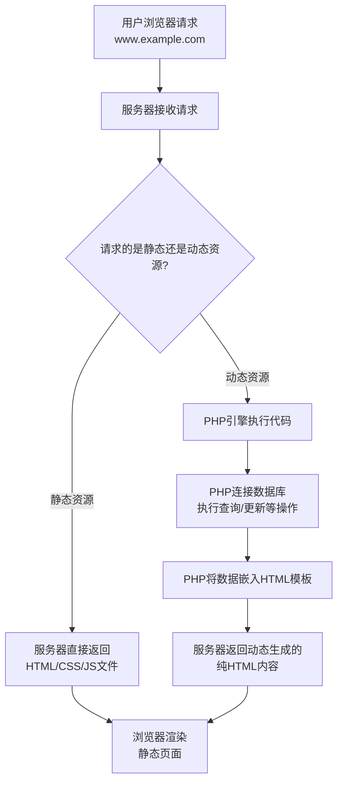

当然可以！这是一个非常好的问题，能帮你建立起对网站开发整体的理解。我们一步步来拆解。

### 1. PHP 是什么？

**PHP**（全称：PHP: Hypertext Preprocessor，即“超文本预处理器”）是一种**开源的服务器端脚本语言**。

这句话里有几个关键点：
*   **服务器端（Server-side）**：这是PHP最核心的特征。这意味着PHP代码不是在用户的浏览器（客户端）上运行的，而是在**远程的服务器（Server）上**运行的。
*   **脚本语言（Scripting Language）**：它是一种解释执行的语言，无需编译成独立的可执行文件，专门用于自动化任务（在这里是动态生成网页内容）。

你可以把PHP想象成网站背后的**“大脑”或“工程师”**。当用户访问一个网站时，这个“工程师”就在服务器上忙活：它从数据库里取数据、进行逻辑计算、然后把处理好的结果组装成HTML，最后再发送给用户的浏览器。

---

### 2. 网站搭建过程 & 涉及的技术

要理解PHP的角色，最好先看一个典型的网站访问流程，以及其中用到的“语言”或“技术”：

下面我们来详细解析图中提到的各项技术：

#### 🎨 前端（Front-end - 在用户浏览器中运行）
这部分的代码决定了网站**长什么样**，以及**如何与用户交互**。
*   **HTML（超文本标记语言）**：网站的**骨架和结构**。它定义了网页的内容，比如标题、段落、图片、链接等。它只是一堆静态的文本和标签。
*   **CSS（层叠样式表）**：网站的**衣服和妆容**。它负责美化HTML内容，定义布局、颜色、字体、大小等，让网站变得好看。
*   **JavaScript (JS)**：网站的**交互行为**。它可以让网页“动”起来，比如处理点击事件、动态更新内容、弹出对话框、发送异步请求（AJAX）等。

#### ⚙️ 后端（Back-end - 在服务器上运行）
这部分的代码决定了网站**做什么**，处理核心逻辑和数据。
*   **PHP / Python / Java / Ruby / Node.js 等**：这些是**服务器端编程语言**，也就是网站的“大脑”。它们负责：
    *   处理表单提交（如用户登录、注册）
    *   操作数据库（如保存用户信息、查询文章内容）
    *   管理用户会话（如保持用户登录状态）
    *   执行复杂的业务逻辑
*   **数据库（Database）**：如 MySQL, PostgreSQL, MongoDB。网站的**仓库**，所有需要持久存储的数据都放在这里，比如用户信息、文章内容、商品数据等。

---

### 3. PHP 与 HTML 的关系

它们不是替代关系，而是**协作和共生**的关系。

*   **HTML是静态的**：一个纯粹的 `.html` 文件写好后，内容就固定了，每次访问看到的内容都一样。
*   **PHP是动态的**：一个 `.php` 文件里面**既可以写HTML代码，也可以写PHP代码**。PHP代码的作用是**动态生成**不同的HTML内容。

**一个简单的例子：显示当前时间**

*   **纯HTML**：你写 `现在时间是：10:00:00`。那么无论谁、在什么时候访问，都只看到“10:00:00”。
*   **PHP + HTML**：你写 `现在时间是：<?php echo date('H:i:s'); ?>`。
    *   当用户访问这个PHP文件时，服务器会执行 `<?php ... ?>` 里面的代码。
    *   `date('H:i:s')` 函数会获取服务器的当前时间。
    *   `echo` 会把这个时间“输出”到那个位置。
    *   最终，服务器发送给浏览器的就是一个纯HTML文件，内容是 `现在时间是：14:30:25`（每次访问时间都不同）。

**所以，PHP和HTML的关系是：PHP inside HTML。** 我们在HTML中嵌入PHP代码，让服务器在发送页面之前，先执行其中的PHP指令，生成最终的HTML。

---

### 4. PHP 在网站搭建中扮演的角色

根据上面的解释，我们可以总结PHP的角色：

1.  **动态内容生成者**：它是网站“动态性”的来源。无论是新闻网站的文章列表、电商网站的商品展示，还是社交网站的朋友圈，都是PHP这类后端语言从数据库读出数据后动态生成的。
2.  **数据库操作者**：它作为中间人，连接前端和数据库，负责增删改查（CRUD）所有数据。
3.  **业务逻辑处理者**：它处理所有核心功能，比如用户认证（登录/退出）、支付流程、数据验证等。

### 总结比喻

如果把搭建一个网站比喻成开一家餐厅：

*   **HTML** 是餐厅的**静态菜单**，上面印着菜名和图片。
*   **CSS** 决定了菜单的**设计和装修风格**，让它看起来美观。
*   **JavaScript** 是**服务员的前端行为**，比如帮你勾选菜品、询问口味。
*   **PHP (后端语言)** 是**后厨**，服务员（JS）把你的订单（请求）交给后厨，后厨根据订单（业务逻辑）去冰箱（数据库）里取食材（数据），炒好菜（处理数据），最后把做好的菜（生成的HTML）端出来。
*   **数据库** 就是那个**冰箱和仓库**，存储所有食材（数据）。

希望这个详细的解释能帮助你彻底理解PHP及其在Web开发中的位置！它是一个强大而灵活的工具，是驱动无数网站（包括Facebook、Wikipedia等）背后的核心动力。